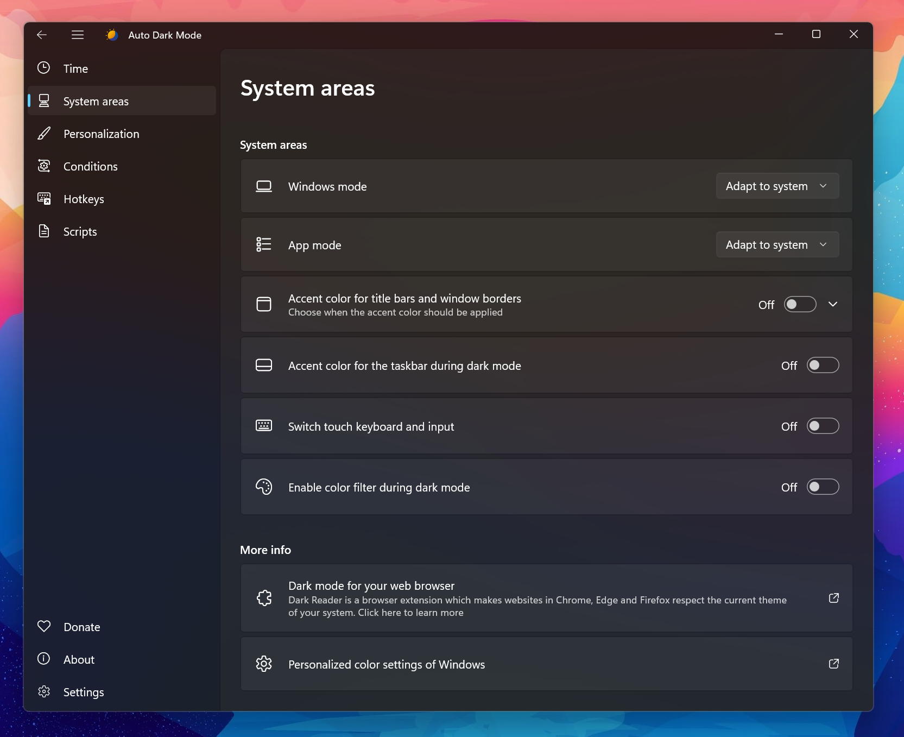

<p align="center">
  
</p>

Switches between the dark and light theme of Windows at scheduled times.

<p href="https://hosted.weblate.org/engage/auto-dark-mode/">
  
</p>

[Features](#features) • [Download](#download) • [Release Notes](https://github.com/AutoDarkMode/Windows-Auto-Night-Mode/releases) • [Wiki](https://github.com/AutoDarkMode/Windows-Auto-Night-Mode/wiki) • [Telegram Group](https://t.me/autodarkmode)

# Auto Dark Mode

Tired of looking at dark content while the sun is shining brightly? But at night everything is suddenly too bright? Auto Dark Mode is the solution for you!

Android, iOS and MacOS already offer the possibility of changing the system design based on the time of the day. We're bringing this feature to Windows on a larger scale.

Auto Dark Mode helps you to be more productive. Because you shouldn't care about changing Windows settings several times a day. As soon as the sun goes down, we'll take care of your eyes.

Because a simple design change would be too boring, Auto Dark Mode is packed with useful functions. For example, we can also change your desktop wallpaper or run custom scripts.

## Features

- Compatible with Windows 10* and Windows 11.
- Theme switch based on sunrise and sunset.
- Postpone or delay the next switch as you like.
- Desktop wallpaper switch.
- Mouse cursor switch.
- Accent color switch.
- Support for turning on/off accent color on the Taskbar and title bars.
- Touch keyboard switch.
- Windows .theme file switch.
- Keyboard shortcuts.
- Auto Dark Mode can enable the grayscale color filter of Windows.
- Suitable for gamers: Doesn't switch while playing games to avoid stuttering.
- Additional features for battery powered devices, like enabling dark mode on battery.
- Run custom scripts.
- Automatic updates.
- Lightweight with clean uninstall. No admin rights needed.

<sup>* Windows 10 versions older than 22H2 are not supported</sup>

## Download

### Download from Microsoft Store

<a href="https://apps.microsoft.com/store/detail/auto-dark-mode/XP8JK4HZBVF435">
  
</a>

### Download from GitHub

[Click here to download the newest version of Auto Dark Mode!](https://github.com/AutoDarkMode/Windows-Auto-Night-Mode/releases/latest)

### Download from WinGet

```powershell
winget install autodarkmode
```

### Even more download options

<details>
  <summary>Click to expand</summary>

#### Via Chocolatey

Download Auto Dark Mode from [Chocolatey](https://chocolatey.org/packages/auto-dark-mode) (unofficial entry).

```powershell
choco install auto-dark-mode
```

#### Via Scoop

Download Auto Dark Mode from [Scoop](https://scoop.sh) (unofficial entry).

- Via portable

```powershell
scoop bucket add dorado https://github.com/chawyehsu/dorado
scoop install autodarkmode
```

- Via non-portable

```powershell
scoop bucket add nonportable
scoop install auto-dark-mode-np
```
<hr>
</details>

#### Installation

Installation is pretty easy, as you only need to run the setup file provided as .exe. If you want to deploy Auto Dark Mode on multiple machines, you can use the argument _/allusers /verysilent_ to skip the installer window.
<br> <br>
Sometimes Windows or web browsers will show a security notice while downloading Auto Dark Mode. This is due to our lack of a developer license. You can ignore these messages.

## Translations

We use Weblate's cool [free Libre plan](https://hosted.weblate.org/hosting/) that supports open source software projects! <br>
You can find our project here: <https://hosted.weblate.org/projects/auto-dark-mode/app/>
<p align="left">
  <a href="https://hosted.weblate.org/engage/auto-dark-mode/">
    
  </a>
</p>

Alternatively, you can manually edit the translation files in `AutoDarkModeApp\Strings`.

## Awards

<a href="https://blogs.windows.com/windowsdeveloper/2022/05/27/announcing-the-microsoft-store-app-awards-winners/">
  
</a>

## More information

Still have open questions? Check out [our wiki](https://github.com/AutoDarkMode/Windows-Auto-Night-Mode/wiki)!
